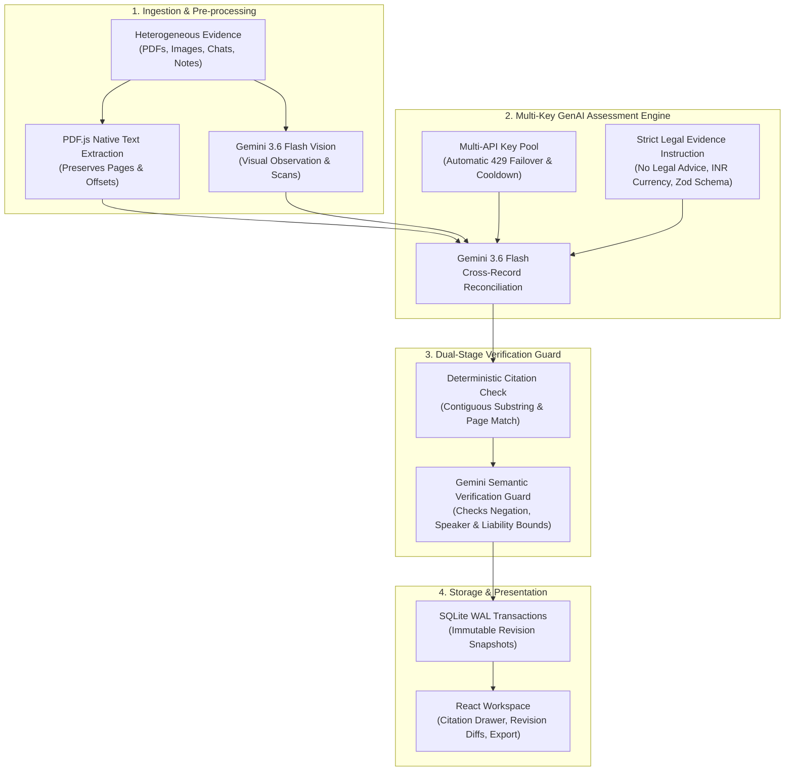

# ⚖️ TRACE — AI Legal Evidence & Deposit Review Engine

> **Making legal information, rental agreements, and disputed claims transparent, inspectable, and verifiable.**  
> Built for **PromptWars: Virtual (Exclusive Edition)** | Problem Statement: *AI for Legal Assistance & Access*

[](https://lex-trace.onrender.com)
[](https://github.com/Shafeeq-Cybersec/lex-trace)
[](https://ai.google.dev/)
[](LICENSE)

---

## 📌 Problem Overview

Legal documents, lease contracts, and financial disputes are notoriously complex, fragmented, and intimidating for non-lawyers. 

In rental deposit disputes, deductions are rarely confined to a single contract. Instead, a tenant faces **disparate, unstructured claims scattered across**:
* Lease agreements and addendums
* Move-in / move-out condition checklists (often handwritten or scanned PDFs)
* Informal communication (WhatsApp messages, emails, SMS)
* Contractor invoices and repair estimates
* Photo evidence of property wear and tear

Tenants lack the legal tooling to understand which deductions are substantiated, which prior records challenge the landlord's allegations, and what evidence is missing before consulting legal counsel.

---

## 💡 The Solution: TRACE

**TRACE** is an evidence-review engine that organizes scattered records into an **inspectable, verifiable, and source-cited legal brief**:

1. **Itemized Claim Extraction:** Identifies stated deductions and exact monetary amounts in INR without hallucinating generic charges.
2. **Bi-directional Citation Linking:** Every claim and evidence item links directly to the exact page and excerpt of the original submitted document.
3. **Multi-Record Relationship Mapping:** Categorizes evidence as **Supports**, **Challenges**, **Qualifies**, or provides **Context**.
4. **Evidence Gap Detection:** Flags critical missing documents (e.g., unitemized invoices, missing move-out signoffs) so tenants know what records to request.
5. **Immutable Revision Snapshots ("What Changed"):** When new evidence is introduced, TRACE preserves the previous review and computes a structured diff of what changed and why.
6. **Printable Legal Aid Brief:** Generates a structured, ready-to-use preparation brief for consultations with legal aid professionals.

---

## 🏛️ GenAI Architecture & Pipeline



### Key Technical Highlights:
* **Multi-API Key Failover:** Built-in key rotation pool that seamlessly catches HTTP 429 rate limits, puts the exhausted key on cooldown, and rotates to healthy keys without aborting user review jobs.
* **Dual-Stage Guardrail:** A deterministic substring validation ensures quotes actually exist on the cited page; followed by a secondary bounded Gemini semantic call ensuring claims do not overstep into legal liability determinations.
* **Pure Provenance:** User statements are explicitly marked as *attributed statements*, not facts. Invoices establish billing, not necessity or proof of payment.

---

## ⚖️ Legal Boundary & Ethics

> [!IMPORTANT]
> **TRACE provides information, structural organization, and preparation assistance; it does NOT replace professional legal advice.**
> 
> - The AI system prompt (`INSTRUCTION`) explicitly forbids determining legal liability, enforceability, entitlement, or what a party can legally charge.
> - All outputs are structured as preparation briefings to help users organize their records before meeting with a qualified attorney or legal aid organization.

---

## 🚀 Live Demo & Quick Start

### 🌐 Live Application
* **Production Deployment:** [https://lex-trace.onrender.com](https://lex-trace.onrender.com)

### 🧪 Test Walkthrough with Bundled Samples
You can test the real end-to-end flow using the fictional records included in `public/samples/`:
1. **Initial Review:** Upload `01-deduction-notice.pdf`, `02-move-in-inspection.pdf`, and `03-renter-messages.txt`.
2. **Inspect Findings:** Open the **Painting Deduction** card. Click the cited quote to inspect the original move-in PDF page showing pre-existing wall scuffs.
3. **Add New Evidence:** Upload `04-new-packing-message.txt` and run review. Notice TRACE retains Revision 1 and opens **Revision 2** with a **What Changed** comparison.
4. **Export:** Click **Print / Export Brief** to generate the legal consultation brief.

---

## 💻 Local Development Setup

### Prerequisites
* **Node.js:** v24+
* **Gemini API Key:** From [Google AI Studio](https://aistudio.google.com/)

### Installation & Run
```bash
# 1. Clone repository
git clone https://github.com/Shafeeq-Cybersec/lex-trace.git
cd lex-trace

# 2. Install dependencies
npm ci

# 3. Configure environment variables
cp .env.example .env
# Open .env and add your GEMINI_API_KEY (supports multiple comma-separated keys)

# 4. Start local development server (API + Vite frontend)
npm run dev
```

Open [http://127.0.0.1:5173/](http://127.0.0.1:5173/) in your browser.

---

## 🧪 Quality & Test Suite

TRACE includes a deterministic test suite with zero external paid model dependencies:

```bash
# Run unit & integration tests (15 suites covering SQLite, Zod, CSRF, key failover)
npm test

# Static type verification
npm run typecheck

# Production build check
npm run build

# Code style formatting check
npm run format:check

# Security audit
npm audit --omit=dev
```

---

## 📁 Repository Structure

```
├── ARCHITECTURE.md          # Detailed engineering design and trade-offs
├── Dockerfile               # Containerized single-instance deployment
├── README.md                # Project documentation and submission guide
├── SECURITY.md              # Security policies and data retention rules
├── docs/
│   ├── SUBMISSION.md        # PromptWars submission brief and script
│   ├── TESTING.md           # Verification protocols
│   └── live-verification.json # Live model verification telemetry
├── public/samples/          # Fictional test files (PDFs, text chats)
├── server/
│   ├── ai.ts                # Gemini extraction, multi-key failover & verification
│   ├── reconciler.ts        # Revision snapshots and diff calculation
│   ├── storage.ts           # SQLite WAL persistence and blob storage
│   └── index.ts             # Express REST API and background job queue
├── src/
│   ├── App.tsx              # React workspace and evidence review UI
│   ├── components/          # DeductionCard, SourceInspector, PrintReview
│   └── api.ts               # Client-side API bindings
└── tests/                   # Deterministic test suites
```

---

## 👥 Authors & Acknowledgments

* **Builder:** [Shafeeq-Cybersec](https://github.com/Shafeeq-Cybersec)
* **Event:** PromptWars: Virtual (Exclusive Edition) — Challenge 2026
* **Model:** Google Gemini (`gemini-3.6-flash`)
